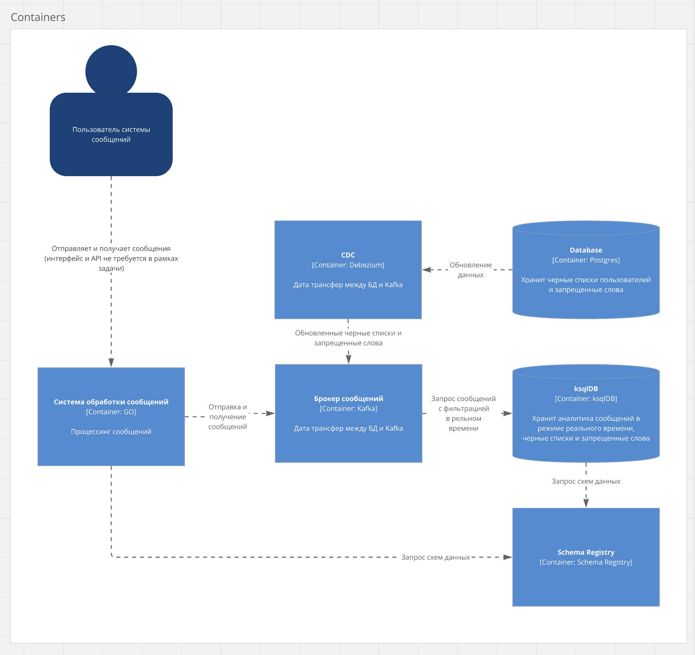

# Goka messenger

## Подготовка окружения

```bash
make up
```
```bash
make init
```

## Архитектура проекта


## Структура проекта

    .
    ├── cmd                  # Основное приложение
    ├── docker               # KSQL скрипты и параметры коннектора
    ├── internal             # Внутренний код
    │   ├── application      # Application layer  
    │   │   ├── app         
    │   │   └── dto
    │   ├── domain           # Domain layer
    │   ├── infra            # Infrastructure layer
    │   │   ├── config        
    │   │   ├── db         
    │   │   ├── di
    │   │   ├── logger
    │   │   ├── msg   
    │   │   ├── repo   
    │   │   └── repo
    │   └── test         
    └── ...

Создать в корне .env

```
DATABASE_DSN=
MSG_TOPIC=
MSG_FILTERED_BLOCK_USERS_TOPIC=
MSG_FILTERED_TOPIC=
SCHEMA_REGISTRY_URL=
KAFKA_BROKERS=
KAFKA_SESSION_TIMEOUT_MS=
KAFKA_AUTO_OFFSET_RESET=
KAFKA_CONSUMER_PULL_TIMEOUT_MS=
KAFKA_ACKS=
```